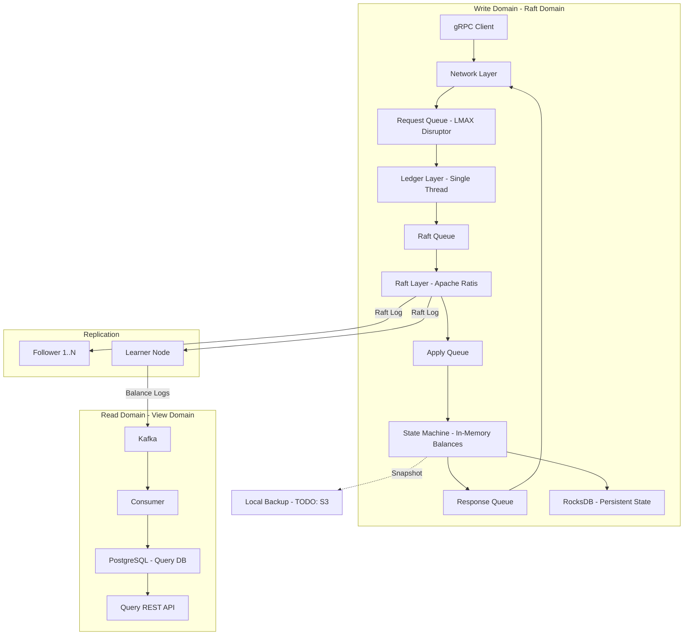

# Binance Ledger Clone — Java Backend Service

A demo backend service implementing the core architectural ideas from the [Binance Ledger article](https://www.binance.com/en/blog/tech/5409682424466769892): a high-throughput, fault-tolerant, in-memory ledger for account balances and transactions.

## Background & Key Concepts from the Article

The Binance Ledger is the backbone service storing all account balances and processing transactions with:
- **High throughput** — millions of TPS at peak
- **24/7 availability** — zero downtime via Raft replication
- **Bit-level accuracy** — zero tolerance for errors

It solves the **"Hot Account Problem"** (row-lock contention in traditional RDBMS) by using:
1. **Memory-centric processing** — all balances live in-memory
2. **Single-threaded state machine** — no locks, no race conditions
3. **LMAX Disruptor** — lock-free ring buffer connecting multi-threaded network layer to single-threaded core
4. **Raft consensus** — leader-based log replication for HA
5. **CQRS** — separate write domain (Raft) and read domain (Kafka → PostgreSQL)
6. **RocksDB** — embedded KV store for persistent state snapshots



---

## Decisions Made (from user feedback)

| Topic | Decision |
|-------|----------|
| Java version | **Java 21** with strategic use of virtual vs platform threads (see below) |
| Containerization | **Fully containerized** — each Raft node is a Docker container |
| Raft cluster size | **Configurable** via env/config (default 3 nodes) |
| Database | **PostgreSQL** (not MySQL) |
| Dashboard | **No UI** — APIs only + OpenAPI/Swagger docs |
| Load generator | **Must have** — required to prove the solution |
| Snapshot storage | **Local filesystem** for now, **TODO: S3 integration later** |
| Documentation | **`doc/` folder** in project root |

---

## Virtual Threads vs Platform Threads Strategy

Java 21 virtual threads are ideal for **I/O-bound, blocking workloads** (waiting on network, DB, etc.) but should be **avoided** for CPU-bound, latency-critical, or pinning-prone paths.

| Layer | Thread Type | Rationale |
|-------|-------------|-----------|
| **gRPC server threads** | ✅ Virtual | I/O-bound: waiting for network reads/writes. Virtual threads allow millions of concurrent RPCs without thread pool exhaustion |
| **Kafka consumer** | ✅ Virtual | I/O-bound: polling broker, writing to PostgreSQL |
| **REST API (View)** | ✅ Virtual | I/O-bound: Spring Boot 3.2+ has native virtual thread support via `spring.threads.virtual.enabled=true` |
| **Load generator client threads** | ✅ Virtual | I/O-bound: simulating many concurrent gRPC clients |
| **LMAX Disruptor consumer** | ❌ Platform | CPU-bound hot loop with `BusySpinWaitStrategy`. Virtual threads would be counter-productive — the Disruptor consumer must pin to a CPU core for minimum latency. Virtual threads are designed to *yield* when idle, which defeats busy-spin |
| **State Machine (single thread)** | ❌ Platform | CPU-bound sequential processing. Must never be preempted or parked. A dedicated platform thread ensures deterministic, uninterrupted execution |
| **Raft internal threads (Ratis)** | ❌ Platform | Apache Ratis manages its own thread pools with `synchronized` blocks and native locks. Virtual threads can *pin* on `synchronized`, causing throughput degradation (JEP 444 limitation) |
| **RocksDB I/O** | ❌ Platform | JNI calls to native C++ code. JNI calls pin the carrier thread, negating virtual thread benefits |

> [!TIP]
> **Evidence**: JEP 444 explicitly warns that virtual threads pinned during `synchronized` blocks or JNI calls lose their scalability advantage. The Disruptor and Ratis both use `synchronized` internally. RocksDB JNI calls are native. For these components, platform threads with explicit thread pools are correct.

---

## Proposed Changes

### Project Structure (Multi-Module Gradle)

```
binance_ledge_clone/
├── build.gradle                    # Root build config
├── settings.gradle                 # Module declarations
├── docker-compose.yml              # Full stack: Kafka, PostgreSQL, Raft nodes
├── Dockerfile                      # Multi-stage build for ledger-server
├── gradle/
│   └── libs.versions.toml          # Version catalog
├── doc/                            # Project documentation
│   ├── architecture.md             # Architecture overview + diagrams
│   ├── api-spec.yml                # OpenAPI 3.0 specification
│   ├── deployment-guide.md         # How to run the cluster
│   └── implementation-plan.md      # This plan (copy)
│
├── ledger-common/                  # Shared models, DTOs, protobuf
│   ├── build.gradle
│   └── src/main/
│       ├── java/.../common/
│       │   ├── model/              # Account, Transaction, Balance
│       │   └── config/             # Shared config constants
│       └── proto/
│           └── ledger.proto        # gRPC service definition
│
├── ledger-core/                    # The heart: state machine + disruptor
│   ├── build.gradle
│   └── src/main/java/.../core/
│       ├── statemachine/           # Single-threaded state machine
│       ├── disruptor/              # LMAX Disruptor pipeline
│       ├── persistence/            # RocksDB snapshot/state
│       └── pipeline/               # Request processing pipeline
│
├── ledger-raft/                    # Raft consensus layer
│   ├── build.gradle
│   └── src/main/java/.../raft/
│       ├── config/                 # Externalized cluster config
│       ├── LedgerRaftStateMachine.java
│       ├── RaftNodeRunner.java
│       └── LearnerNode.java
│
├── ledger-server/                  # gRPC server (write domain)
│   ├── build.gradle
│   └── src/main/
│       ├── java/.../server/
│       │   ├── LedgerServerApplication.java
│       │   ├── grpc/
│       │   └── config/
│       └── resources/
│           └── application.yml     # Externalized config (env-overridable)
│
├── ledger-view/                    # Query domain (CQRS read side)
│   ├── build.gradle
│   └── src/main/
│       ├── java/.../view/
│       │   ├── LedgerViewApplication.java
│       │   ├── consumer/
│       │   ├── repository/
│       │   ├── service/
│       │   ├── controller/
│       │   └── reconciliation/
│       └── resources/
│           └── application.yml
│
├── ledger-benchmark/               # JMH benchmarks
│   └── ...
│
└── ledger-loadgen/                 # Load generator / demo client
    └── ...
```

---

### Module 1: `ledger-common` — Shared Models & Protobuf

#### [NEW] ledger.proto
- gRPC service definition with RPCs: `Deposit`, `Withdraw`, `Transfer`, `GetBalance`
- Message types: `TransactionRequest`, `TransactionResponse`, `BalanceQuery`, `BalanceResponse`
- Enum: `TransactionType` (DEPOSIT, WITHDRAWAL, TRANSFER)

#### [NEW] Core domain models
- `Account` — userId, asset, balance (using `BigDecimal` for precision)
- `Transaction` — txId, type, fromAccount, toAccount, amount, timestamp, status
- `AccountKey` — composite key (userId + asset) for the in-memory map

---

### Module 2: `ledger-core` — State Machine + LMAX Disruptor

#### [NEW] InMemoryBalanceStore.java
- `ConcurrentHashMap<AccountKey, BigDecimal>` for balances
- Operations: `credit()`, `debit()`, `getBalance()`, `getAllBalances()`
- Single-threaded access — no locks needed

#### [NEW] TransactionProcessor.java
- **Single platform thread** — validates and applies transactions
- Returns `TransactionResult` with success/failure + new balance

#### [NEW] LMAX Disruptor Pipeline
- `TransactionEvent` — mutable event object pre-allocated in ring buffer
- `LedgerDisruptorConfig` — ring buffer size (power of 2), wait strategy configurable
- Consumer runs on a **dedicated platform thread** (not virtual — see thread strategy above)

#### [NEW] RocksDB Persistence
- `RocksDBStateStore` — wraps `org.rocksdb.RocksDB` with typed operations
- `SnapshotManager` — consistent snapshots at Raft log indexes, backup to local directory

> [!NOTE]
> **TODO**: Add S3-compatible snapshot upload in `SnapshotManager`. Currently uses local filesystem backup. Interface is designed to be pluggable (`SnapshotBackend` interface with `LocalSnapshotBackend` and future `S3SnapshotBackend` implementations).

---

### Module 3: `ledger-raft` — Raft Consensus via Apache Ratis

#### [NEW] LedgerRaftStateMachine.java
- Extends `org.apache.ratis.statemachine.impl.BaseStateMachine`
- `applyTransaction()` → `takeSnapshot()` → `loadSnapshot()` lifecycle

#### [NEW] Externalized Cluster Configuration
All Raft cluster parameters read from **environment variables / `application.yml`**, zero hardcoding:

```yaml
# application.yml (overridable via env vars)
ledger:
  raft:
    node-id: ${RAFT_NODE_ID:node1}
    address: ${RAFT_ADDRESS:0.0.0.0}
    port: ${RAFT_PORT:10001}
    storage-dir: ${RAFT_STORAGE_DIR:/data/raft}
    peers: ${RAFT_PEERS:node1:10001,node2:10002,node3:10003}
    learners: ${RAFT_LEARNERS:}  # empty = no learners
    snapshot-interval: ${RAFT_SNAPSHOT_INTERVAL:1000}
    snapshot-interval-seconds: ${RAFT_SNAPSHOT_INTERVAL_SECONDS:3600}
    election-timeout-ms: ${RAFT_ELECTION_TIMEOUT:5000}
```

#### [NEW] LearnerNode.java
- Non-voting Raft member streaming committed entries to Kafka
- Configurable via `RAFT_LEARNERS` env var

---

### Module 4: `ledger-server` — Spring Boot gRPC Server (Write Domain)

#### [NEW] LedgerServerApplication.java
- Spring Boot 3.x + Java 21
- Bootstraps: Disruptor, Raft node, RocksDB
- gRPC server uses **virtual threads** for request handling

#### Request Processing Flow:
```
1. gRPC Thread (virtual)  → Deserialize request
2. Disruptor              → Publish to ring buffer
3. Ledger Thread (platform) → Process transaction
4. Raft Client            → Submit to Raft leader
5. Raft Consensus         → Replicate to followers
6. Apply                  → Apply to State Machine
7. Disruptor              → Publish response
8. gRPC Thread (virtual)  → Return to client
```

---

### Module 5: `ledger-view` — Spring Boot REST Server (Query/Read Domain)

#### [NEW] KafkaBalanceConsumer.java
- Consumes `ledger-balance-changes` → writes to **PostgreSQL**
- Idempotent via transaction ID deduplication

#### [NEW] QueryController.java + OpenAPI
REST endpoints with **SpringDoc OpenAPI 3.0** annotations:
- `GET /api/v1/accounts/{userId}` — list all assets/balances
- `GET /api/v1/accounts/{userId}/assets/{asset}` — specific balance
- `GET /api/v1/transactions` — paginated history with filters
- `GET /api/v1/health/cluster` — Raft cluster status

OpenAPI spec auto-generated + exported to `doc/api-spec.yml`

#### [NEW] ReconciliationDaemon.java
- Scheduled comparison: PostgreSQL vs in-memory state

**Key dependencies**: `spring-boot-starter-web`, `spring-boot-starter-data-jpa`, `spring-kafka`, `postgresql`, `springdoc-openapi-starter-webmvc-ui`

---

### Module 6: `ledger-loadgen` — Load Generator (Must Have)

- CLI application with configurable concurrency, duration, TPS target
- Uses **virtual threads** to simulate thousands of concurrent gRPC clients
- Scenarios: `Deposit`, `Withdraw`, `Transfer`, `HotAccount`
- Reports: latency percentiles (p50, p95, p99), throughput, error rate
- Proves the hot-account advantage of the architecture

---

### Infrastructure

#### [NEW] docker-compose.yml
```yaml
services:
  # --- Infrastructure ---
  kafka:
    image: confluentinc/cp-kafka:7.5.0
    ports:
      - "9092:9092"
    environment:
      KAFKA_NODE_ID: 1
      KAFKA_LISTENER_SECURITY_PROTOCOL_MAP: 'CONTROLLER:PLAINTEXT,PLAINTEXT:PLAINTEXT,PLAINTEXT_HOST:PLAINTEXT'
      KAFKA_ADVERTISED_LISTENERS: 'PLAINTEXT://kafka:29092,PLAINTEXT_HOST://localhost:9092'
      KAFKA_PROCESS_ROLES: 'broker,controller'
      KAFKA_CONTROLLER_QUORUM_VOTERS: '1@kafka:29093'
      KAFKA_LISTENERS: 'PLAINTEXT://kafka:29092,CONTROLLER://kafka:29093,PLAINTEXT_HOST://0.0.0.0:9092'
      KAFKA_INTER_BROKER_LISTENER_NAME: 'PLAINTEXT'
      KAFKA_CONTROLLER_LISTENER_NAMES: 'CONTROLLER'
      KAFKA_OFFSETS_TOPIC_REPLICATION_FACTOR: 1
      KAFKA_GROUP_INITIAL_REBALANCE_DELAY_MS: 0
      CLUSTER_ID: 'MkU3OEVBNTcwNTJENDM2Qk'
  postgres:
    image: postgres:16
    environment:
      POSTGRES_DB: ledger_view
      POSTGRES_USER: ledger
      POSTGRES_PASSWORD: ledger

  # --- Raft Cluster (configurable replicas) ---
  ledger-node-1:
    build: .
    environment:
      RAFT_NODE_ID: node1
      RAFT_PORT: 10001
      RAFT_PEERS: node1:10001,node2:10002,node3:10003
  ledger-node-2:
    build: .
    environment:
      RAFT_NODE_ID: node2
      RAFT_PORT: 10002
      RAFT_PEERS: node1:10001,node2:10002,node3:10003
  ledger-node-3:
    build: .
    environment:
      RAFT_NODE_ID: node3
      RAFT_PORT: 10003
      RAFT_PEERS: node1:10001,node2:10002,node3:10003

  # --- View Domain ---
  ledger-view:
    build:
      context: .
      dockerfile: Dockerfile.view
    environment:
      SPRING_DATASOURCE_URL: jdbc:postgresql://postgres:5432/ledger_view
      SPRING_KAFKA_BOOTSTRAP_SERVERS: kafka:9092
```

#### [NEW] PostgreSQL Schema
```sql
CREATE TABLE accounts (
    id BIGSERIAL PRIMARY KEY,
    user_id VARCHAR(64) NOT NULL,
    asset VARCHAR(16) NOT NULL,
    balance NUMERIC(36, 18) NOT NULL DEFAULT 0,
    updated_at TIMESTAMPTZ DEFAULT NOW(),
    UNIQUE (user_id, asset)
);

CREATE TABLE transactions (
    id BIGSERIAL PRIMARY KEY,
    tx_id VARCHAR(64) NOT NULL UNIQUE,
    type VARCHAR(16) NOT NULL CHECK (type IN ('DEPOSIT', 'WITHDRAWAL', 'TRANSFER')),
    from_user_id VARCHAR(64),
    to_user_id VARCHAR(64),
    asset VARCHAR(16) NOT NULL,
    amount NUMERIC(36, 18) NOT NULL,
    status VARCHAR(8) NOT NULL CHECK (status IN ('SUCCESS', 'FAILED')),
    raft_log_index BIGINT,
    created_at TIMESTAMPTZ DEFAULT NOW()
);

CREATE INDEX idx_tx_user ON transactions(from_user_id, created_at);
CREATE INDEX idx_tx_to_user ON transactions(to_user_id, created_at);
```

---

## Technology Stack Summary

| Component | Technology | Version | Purpose |
|-----------|-----------|---------|---------|
| Language | Java | 21 | Core language (virtual threads for I/O) |
| Build | Gradle | 8.x | Multi-module build |
| Framework | Spring Boot | 3.2+ | Application framework (virtual thread support) |
| Ring Buffer | LMAX Disruptor | 4.0.0 | Lock-free inter-thread messaging |
| Consensus | Apache Ratis | 3.1.x | Raft protocol implementation |
| State Store | RocksDB (JNI) | 9.x | Embedded KV persistence |
| RPC | gRPC + Protobuf | 1.60+ | Write domain API |
| Messaging | Apache Kafka | 3.x | CQRS event streaming |
| Query DB | PostgreSQL | 16 | Read domain storage |
| REST | Spring Web | 3.2+ | Read domain API |
| API Docs | SpringDoc OpenAPI | 2.x | OpenAPI 3.0 spec generation |
| Benchmark | JMH | 1.37 | Performance measurement |
| Container | Docker + Compose | latest | Full stack deployment |

---

## Phased Execution Plan

### Phase 1: Foundation (Core + Common)
1. Set up Gradle multi-module project structure + `doc/` folder
2. Define Protobuf schemas and generate code
3. Implement `InMemoryBalanceStore` + `TransactionProcessor`
4. Implement LMAX Disruptor pipeline (platform thread consumer)
5. Unit test the state machine in isolation

### Phase 2: Persistence (RocksDB)
1. Implement `RocksDBStateStore`
2. Implement `SnapshotManager` with `SnapshotBackend` interface (local impl + TODO: S3)
3. Integration test: state machine → RocksDB → reload

### Phase 3: Consensus (Raft)
1. Implement `LedgerRaftStateMachine` extending Apache Ratis
2. Externalized cluster config (env vars + application.yml)
3. Integration test: leader election, log replication, failover

### Phase 4: Write Server (gRPC) + Containerization
1. Build `ledger-server` Spring Boot application (Java 21, virtual threads for gRPC)
2. Wire: gRPC → Disruptor → Raft → State Machine → Response
3. Dockerfile (multi-stage build)
4. End-to-end test: deposit/withdraw/transfer via gRPC client

### Phase 5: Read Domain (CQRS)
1. Docker Compose (Kafka + PostgreSQL + Raft nodes)
2. Implement Learner Node → Kafka producer
3. Implement Kafka consumer → PostgreSQL writer
4. Build REST query API + OpenAPI spec (SpringDoc)
5. Implement reconciliation daemon

### Phase 6: Load Test & Polish
1. Load generator with all scenarios (virtual threads for concurrency)
2. Hot-account scenario to prove architecture advantage
3. JMH benchmarks
4. Documentation in `doc/` folder
5. Full docker-compose deployment verification

---

## Verification Plan

### Automated Tests
- **Unit tests**: State machine correctness, balance operations, edge cases
- **Integration tests**: Disruptor pipeline, RocksDB round-trip, Raft replication
- **End-to-end tests**: Full transaction flow → verify in PostgreSQL view
- **Command**: `./gradlew test`

### Performance Benchmarks
- **Command**: `./gradlew :ledger-benchmark:jmh`
- Expected: Disruptor pipeline > 1M events/sec, state machine > 500K ops/sec

### Load Testing
- Run `ledger-loadgen` with hot-account scenario against containerized cluster
- Verify: throughput, latency percentiles, zero balance discrepancies

### Manual Verification
1. `docker compose up` — full stack
2. Run load generator → verify balances match between in-memory and PostgreSQL
3. Kill leader container → verify automatic failover
4. Restart killed container → verify state recovery from RocksDB snapshot
